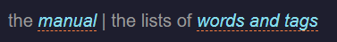
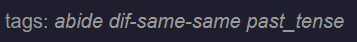
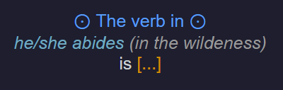

# Ultimate-English-Irregular-Verbs

## Languages for the manual

- [English](#english-manual)
- [Ukrainian](#ukrainian-manual)

## Description

In this deck, you will find and, most importantly, learn 183 English verbs with irregular conjugation patterns. Each
verb has 3 notes for infinitive, past tense and past participle forms (except for the **to-be**, which has 6 notes).

Do the math and you will find out that there are 549 notes to learn but don't be afraid of the amount of notes, it only
looks scary.

If you will do everything according to the manual belove, you will learn all the conjugations here in a month/month and
a half, it depends on how well you will remember the conjugations.

All the notes in this deck are automatically made from the data in the [json file](static/Eng%20Irregular%20Verbs.json)
by my [script](main.py).

The inspiration for this deck came from seeing the Ultimate Spanish Conjugation deck, here are several links to
it: [Anki](https://ankiweb.net/shared/info/638411848), [manual](http://www.asiteaboutnothing.net/w_ultimate_spanish_conjugation.html)
and [GitHub](https://github.com/boolbag/Anki-Goodies/tree/master/Decks/Spanish)

---

## English Manual

In my opinion this manual is a **Must-Read** to properly use this deck because you will probably spend here about a
month/month and a half. So please, spend some time on reading this to understand how everything works.

Before we start, here is where things are:

- Install the deck from [AnkiWeb](https://ankiweb.net/shared/info/154222898)
  or [this file](%5BShared%5D%20Ultimate%20English%20Irregular%20Conjugation.apkg) here, on GitHub.
- To use it, you need to install
  either [Ankidroid](https://play.google.com/store/apps/details?id=com.ichi2.anki&hl=en) (
  Android), [Anki Desktop](https://apps.ankiweb.net/) (Windows | Mac | Linux),
  or [AnkiMobile](https://apps.apple.com/us/app/ankimobile-flashcards/id373493387) (iOS).
- You can help in improving this deck or fixing errors here,
  on [GitHub](https://github.com/Enkidu-Chains/Ultimate-English-Irregular-Conjugation).

### Index

- [Anatomy of a Flashcard](#anatomy-of-a-flashcard)
- [Verbal and Visual Cues](#verbal-and-visual-cues)
- [How to Pace the Study?](#how-to-pace-the-study)
- [Tags and Filtering](#tags-and-filtering)

### Anatomy of a Flashcard

Here's how the card looks like

#### **The Prompt:**

The prompt is the front side of the card.

- The verb to conjugate appears `[...in brackets...]`
- Here the phrase `At that time,` and the back arrow `←` alert you that the tense to use is the *past tense*

Sometimes a greyed out fragment — here, `(the arm)` — is shown as a hint to give more sense to the phrase. *But the
phrase doesn't have to make sense, the point is not to learn phrases but to conjugate the verb.*

#### **The Answer:**

The top part of the 'back' of the card shows the answer.

#### **Verbs in the Same Family:**

Not implemented yet

#### **Notes: Infinitive Part of Notes:**

Each card has such a part at the top of the notes.

- The infinitive form of the verb — here, *`break`* — is also a link to the Cambridge Dictionary with the definition in
  English.
- Second comes the reading — here, *`[bɹɛ́jk]`*  —, the source of the reading for word
  is [Cube Dictionary](http://cube.elte.hu/)
- The last part is the translation, by default to Ukrainian — here, розбити, зламати —, I
  used [DeepL](https://www.deepl.com/translator) and [Google](https://translate.google.com/) Translators, and my own
  knowledge.

#### **Notes: Conjugation Part of Notes:**

Each card has such a part after the one above.

- It shows conjugated form of the verb — here, `broke`.
- And its reading — here, *`[bɹə́wk]`*.

#### **Notes: Regular Conjugation Part of Notes:**

Some irregular verbs have regular past and past participle conjugation forms, so they have such a part of notes.

- It shows regularly conjugated form of the verb — here, `abided`.
- And its reading — here, *`[əbɑ́jdɪd]`*.

#### **Notes: UA Dictionary:**

The link to the Cambridge Dictionary with Ukrainian translation.

#### **Manual:**

The link to this manual and the lists of tags and words.

#### **Tags:**

The list of tags to this note.

### Verbal and Visual Cues

This section guides you through the verbal and visual "shortcuts" that are meant to make your studying faster and
easier.

#### **Infinitive:**

Prompts for the *infinitive* have:

- a verbal cue: `The verb in`
- a visual cue, the bull's eye symbol: `⊙`

The card is prompting for *abide*.

#### **Past Tense:**

Prompts for the *past tense* have:

- a verbal cue: `At that time,`
- a visual cue, the left arrow  `←`

The card is prompting for *abode*.

#### **Past Participle:**

Prompts for the *past participle* have a verbal cue: `Jonatan has`

The card is prompting for *abode*.

### How to Pace the Study?

First, create new deck options for this deck and use these settings there:

Anki version > 2.1.46 (the options menu changed then)

- New cards per day: 30
- Maximum reviews per day: 300
- Learning steps: 2m 15m 1d 4d 10d
- Graduating interval: 30
- Easy interval: 4
- Insertion order: sequential
- Lapses: 15m 1 9999 Tag only
- Maximum answer seconds: 60
- Burying: both unchecked
- Advanced: 1826 2.50 1.30 1.00 1.20 0.00

Anki version < 2.1.46 (the options menu was different then)

- New cards: steps = 2 15 1440 5760 14400, order = new cards in order added, new cards/day = 30, graduating interval =
  30, easy interval = 4, starting ease = 250%
- Reviews: maximum = 300, easy bonus = 130%, interval modifier = 100%, maximum interval = 1826
- Lapses: steps = 15, new interval = 0%, minimum interval = 1 day, leech threshold = 9999, leech action = tag only
- General: max answer time = 60 seconds, show answer timer

Anki will make everything automatically.

### Tags and Filtering

Although this is not how I recommend beginners use the deck, if you're an advanced student at times you may want to
focus your study on a specific section of the deck. To do so, you can create filtered decks using the tags
from [this file](List%20of%20Words%20and%20Tags.md).

---

## Ukrainian Manual

На мою думку ви **маєте** прочитати цей мануал щоб правильно використовувати цю колоду, тому що ви, напевно, проведете в
ній десь місяць/місяць з половиною. Тому будь ласка, витратьте декілька хвилин свого часу на читання мануалу щоб
розуміти як все працює.

Перд тим як ми почнемо, ви:

- маєте встановити колоду карток з [AnkiWeb](https://ankiweb.net/shared/info/154222898)
  або [цього файлу]((%5BShared%5D%20Ultimate%20English%20Irregular%20Conjugation.apkg)) тут, на GitHub.
- щоб використовувати це, маєте встановити одну з цих
  програм: [Ankidroid](https://play.google.com/store/apps/details?id=com.ichi2.anki&hl=en) (
  Android), [Anki Desktop](https://apps.ankiweb.net/) (Windows | Mac | Linux),
  чи [AnkiMobile](https://apps.apple.com/us/app/ankimobile-flashcards/id373493387) (iOS).
- Ви також можете покращити цю колоду, або виправти помилки тут,
  на [GitHub](<https://github.com/Enkidu-Chains/Ultimate-English-Irregular-Conjugation>).

### Індекс

- [Анатомія Флеш-Картки](#анатомія-флеш-картки)
- [Посібник з Вербальних та Візуальних Підказок](#посібник-з-вербальних-та-візуальних-підказок)
- [Як Регулювати Темп Навчання?](#як-регулювати-темп-навчання)
- [Теги та Фільтрація](#теги-та-фільтрація)

### Анатомія Флеш-Картки

Ось як виглядає одна картка

#### **Промпт:**

Промтп - це пердня сторона картки.

- Дієслово, яке ви маєте відмінювати, зявляється в `[...душках...]`
- Фраза `At that time,` й сстрілка, яка дивиться в ліво, `←` повідомляє вас, що ви маєте використати дієслово в формі
  *минулого часу*

Деколи фрагмент, виділений сірим — тут, `(the arm)` — зявляється щоб дати фразі більше сенсу. *Але фраза не завжди має
мати сенс, ціль не в вивченні фаз, а в виченні дієвідмін.*

#### **Відповідь:**

На верхній частині задньої сторони картки показана відповідь.

#### **Дієслова з однієї сімї:**

Ще не ралізовано.

#### **Примітка: Інфінітив:**

Кожна картка має таку частину зверху довідки.

- Інфінітивна форма дієслова — тут, *`break`* — також є посиланням на Кембриджський словник з визначенням англійською
  мовою.
- Далі йде читання — тут *`[bɹɛ́jk]`* —, джерелом читання для слова є [Cube Dictionary](http://cube.elte.hu/)
- Остання частина - це переклад, за замовчуванням на українську мову — тут, *розбити, зламати* —, я використовував
  перекладачі [DeepL](https://www.deepl.com/translator) та [Google](https://translate.google.com/), а також свої власні
  знання.

#### **Примітка: Дієвідмінювання:**

Кожна картка має таку частину після наведеної вище.

- Тут показано дієвідмінювану форму дієслова — тут, `broke`.
- І його читання — тут, *`[bɹə́wk]`*.

#### **Примітка: Регулягне Дієвідмінювання

Деякі неправильні дієслова мають правильні форми минулого часу та дієприкметника, тому вони мають таку частину.

- Тут показано правильну дієвідмінювану форму дієслова - тут, `abided`.
- І його читання - тут, *`[əbɑ́jdɪd]`*.

#### **Примітка: UA Dictionary:**

Посилання на Кембриджський словник з українським перекладом.

#### **Мануал:**

Посилання на цей посібник та списки тегів і слів.

#### **Теги:**

Список тегів до цієї замітки.

### Посібник з Вербальних та Візуальних Підказок

У цьому розділі ви дізнаєтеся про вербальні та візуальні "ярлики", які допоможуть вам швидше та легше засвоїти матеріал.

#### **Інфінітив:**

Підказки для *інфінітива* мають

- вербальну підказку: `The verb in`
- візуальну підказку, символ "око яблучко": `⊙`

Картка спонукає до *abide*.

#### **Минулий Час:**

Підказки для *минулого часу* мають

- вербальну підказку: `At that time,`.
- візуальну підказку, стрілка вліво `←`.

Картка спонукає до *abode*.

#### **Дієприкметник Минулого Часу:**

Підказки для *дієприкметника минулого часу* мають словесну підказку: `Jonatan has`.

Картка спонукає до *abode*.

### Як регулювати темп навчання?

Спочатку створіть нові опції колоди для цієї колоди і використовуйте ці налаштування там:

Версія Anki > 2.1.46 (тоді меню опцій змінилося)

- Нові карти на день: 30
- Максимальне число перевірок на день: 300
- Кроки навчання: 2м 15м 1д 4д 10д
- Випускний інтервал: 30
- Легкий інтервал: 4
- Порядок вставки: послідовний
- Пропуски: 15м 1 9999 Тільки мітка
- Максимальна кількість секунд на відповідь: 60
- Поховання: обидва не позначені
- Просунуті: 1826 2.50 1.30 1.00 1.20 0.00

Версія Anki < 2.1.46 (тоді меню опцій було іншим)

- Нові картки: кроки = 2 15 1440 5760 14400, порядок = додано нові картки в порядку додавання, нові картки/день = 30,
  випускний інтервал = 30, легкий інтервал = 4, легкість старту = 250%.
- Перевірки: максимум = 300, легкий бонус = 130%, модифікатор інтервалу = 100%, максимальний інтервал = 1826
- Пропуски: кроків = 15, новий інтервал = 0%, мінімальний інтервал = 1 день, поріг п'явок = 9999, дія п'явок = тільки
  тег
- Загальні: максимальний час відповіді = 60 секунд, показувати таймер відповіді

Anki зробить все автоматично.

### Теги та Фільтрація

Хоча я не рекомендую використовувати колоду в такий спосіб новачкам, але якщо ви просунутий учень, іноді вам може
знадобитися зосередитися на вивченні певної частини колоди. Для цього ви можете створити відфільтровані колоди за
допомогою тегів з [цього файлу](List%20of%20Words%20and%20Tags.md).
